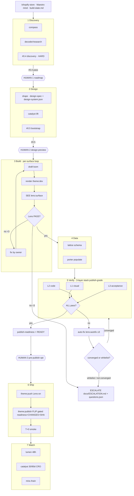

# Boldteq AIM v1 — Visual Wireframe (Shopify Website Department)

Companion to `AIM-V1-ADVANCED-INTELLIGENCE-MODEL.md`. ASCII / FigJam-style. Every box is a real gate, script, agent, or artifact in `theme-toolkit/`.

---

## 1. FULL SYSTEM FLOW (top-level)

```
╔══════════════════════════════════════════════════════════════════════════════════╗
║         AIM v1 · SHOPIFY WEBSITE · autonomous build → verify → auto-fix             ║
║   "never 'done' until visual + code both pass · auto-fix ≤3 · ask only if blocked"  ║
╚══════════════════════════════════════════════════════════════════════════════════╝

  ENTRY: /shopify-store   =  THE MAESTRO MIND (one session; carries docs/build-state.md)
           │  calls the 14 agents as CONSULTANTS; onyx stays independent
           ▼
┌─ PHASE 1 · DISCOVERY ────────────────────────────────────────────────┐
│  compass · nova→scout→atlas · decoder                                  │
│  → docs/discovery/goals.json  +  docs/design/brand-direction.md        │
│  GATE #0.4 discovery — REFUSE dispatch if missing            ◄── HARD  │
└───────────────────────────────────────────────────┬──────────────────┘
                  ▲ HUMAN #1: roadmap / brief confirm │
┌─ PHASE 2 · DESIGN ───────────────────────────────────▼────────────────┐
│  drape → docs/design/design-spec.md + design-system.json               │
│  catalyst → lift target (niche_benchmark × 2.5)                        │
│  GATE #0.5 bootstrap — foundation exists                     ◄── HARD  │
└───────────────────────────────────────────────────┬──────────────────┘
                  ▲ HUMAN #2: design-preview (LIVE staging link, not a mockup)
┌─ PHASE 3 · BUILD  — the PER-SURFACE MAESTRO LOOP (≤3 rounds/surface) ──▼┐
│   for surface ∈ [home, collection, pdp, cart, search, account]:        │
│   ┌────────────────────────────────────────────────────────────────┐  │
│   │ draft(loom) → render(theme:dev) → SEE(lens:surface) → critique  │  │
│   │      ▲                                            │              │  │
│   │      └────────── fix (route by fix_owner) ◄───────┘  converge?   │  │
│   │  consultants called WITH state: drape · ink · lattice · beacon   │  │
│   └────────────────────────────────────────────────────────────────┘  │
│   record → build-state.md   ·   3 rounds → ESCALATE that surface        │
└──────────────────────────────────────────────────┬─────────────────────┘
┌─ PHASE 4 · DATA ──────────────────────────────────▼─────────────────────┐
│  lattice → docs/metafield-schema.json   ·   porter → populate store       │
│  store:preflight → store:apply → store:verify   (NO orders/customers/pay)  │
└──────────────────────────────────────────────────┬─────────────────────┘
┌─ PHASE 5 · VERIFY · the 3-layer gate stack (PUBLISH grade) ─────────────▼┐
│  L1 VISUAL  #18 Lens · #1 lighthouse · #5 axe · #16 a11y · #17 onyx · #19 │
│  L2 CODE    #2 theme-check · #8/#9 ds · #14 render-wiring · #15 commerce · │
│             #11 antipatterns · #3 editability · #13 honesty               │
│  L3 ACCEPT  CHANGES.md · #6 seo · #7/#21 conversion · #10 functional      │
│  env: DS_REQUIRE_SCOPE=1 · LENS_REQUIRE=1   (#0.4/#0.5/#18 BLOCK, not warn)│
└──────────────────────────────────────────────────┬─────────────────────┘
                                                    ▼
                                      ┌──────── ALL PASS? ────────┐
                                  YES │                           │ NO (blocker)
                                      ▼                           ▼
                          ┌────────────────────┐      ┌──────────────────────────┐
                          │ docs/publish-       │      │ AUTO-FIX (lens:autofix)    │
                          │ readiness.json      │      │ route by fix_owner ≤3      │
                          │ = PUBLISH-READY     │      │ loom/drape/ink/conduit→code │
                          └─────────┬──────────┘      │ porter→store-data work-order│
                                    │                  └───────────┬──────────────┘
┌─ PHASE 6 · SHIP ──────────────────▼─────────┐         converged?│ no / whitelist hit
│  (optional HUMAN #3: pre-publish confirm)    │              ┌────▼─────────────────┐
│  theme:push (Lens default-ON) → theme:publish│              │ ESCALATE → human      │
│  gated: readiness + CHANGES.md + gates fresh │              │ docs/ESCALATION.md    │
│  + SHA==HEAD  → FLIP to LIVE  → T+0 smoke     │              │ docs/questions.json   │
└──────────────────────────────────┬───────────┘             │ (whitelist-tagged ask)│
┌─ PHASE 7 · WATCH ─────────────────▼──────────┐             └───────────────────────┘
│  lumen 48h watch (T+2h/24h/48h) · catalyst   │   HUMAN TOUCHPOINTS (autonomous tier):
│  30/90d CRO results loop (scheduled) ·        │   #1 roadmap · #2 design-preview
│  mira → /train lessons                        │   (#3 pre-publish = optional)
└───────────────────────────────────────────────┘
```

---

## 2. THE PER-SURFACE MAESTRO LOOP (detail)

```
                        ┌────────────────────────────────┐
                        │  build-state.md (the carried    │
                        │  mind: design-system + decisions)│
                        └───────────────┬─────────────────┘
                                        │  per surface, round r (1..3)
                                        ▼
        ┌────────────┐   ┌──────────────┐   ┌──────────────────┐   ┌──────────────┐
        │  DRAFT      │──▶│   RENDER     │──▶│   SEE (Lens)     │──▶│  CRITIQUE     │
        │  loom +     │   │  theme:dev   │   │ lens:surface     │   │ judge verdict │
        │  consultants│   │ (hot-reload) │   │ capture+judge+#18│   │ + findings    │
        └─────────────┘   └──────────────┘   └──────────────────┘   └──────┬───────┘
              ▲                                                             │
              │                       PASS → record(PASS) → next surface    │
              │                                                             ▼
              │                                                    ┌─────────────────┐
              └──────────── r<3: fix, route by fix_owner ◀─────────│  Lens PASS?     │
                                                                   └────────┬────────┘
                                          r=3 (no converge) → ESCALATE surface
```

`fix_owner` routing: **loom** = layout/Liquid · **drape** = design-system · **ink** = copy · **conduit** = dynamic binding · **porter** = store data (ESCALATE — never blind store edits).

---

## 3. THE 3-LAYER GATE STACK (what each layer enforces)

```
┌─ LAYER 1 · VISUAL — "renders right at pixels?" ──────────────────────────┐
│  #18 visual-truth (Lens)   capture → vision judge → enforce               │
│  #1 lighthouse  LCP/CLS/INP        #5 axe  WCAG AA      #16 a11y-static    │
│  #17 visual-quality (onyx attests, INDEPENDENT)   #19 section-cohesion     │
└──────────────────────────────────────────────────────────────────────────┘
┌─ LAYER 2 · CODE — "sound, honest, transacting?" ─────────────────────────┐
│  #2 theme-check    #8 design-system   #9 consistency    #11 antipatterns   │
│  #3 editability    #13 honesty (no fake urgency/fabricated proof)          │
│  #14 render-wiring (tokens RENDER)    #15 commerce-readiness (PDP sells)   │
└──────────────────────────────────────────────────────────────────────────┘
┌─ LAYER 3 · ACCEPTANCE — "solved the ask + will convert?" ────────────────┐
│  CHANGES.md (check-changes-list.mjs)  every -[x] has evidence             │
│  #6 seo    #7 conversion    #21 conversion-signoff (lift_target signed)    │
│  #10 functional (cart→checkout)   publish-readiness + --verify --require-full│
└──────────────────────────────────────────────────────────────────────────┘
```

---

## 4. AUTO-FIX → ESCALATE DECISION

```
                    GATE / LENS FAILS
                          │
                  classify: gate id · fix_owner · severity
                          │
            ┌─────────────┴─────────────┐
       owner-fixable                whitelist hit?
       (code/design/copy/bind)      (brand id · money · legal ·
            │                        data-loss · real-asset-missing ·
       round ≤ cap?                  hard input conflict)
       ┌────┴────┐                        │
      YES        NO                       ▼
       │          │                 ┌──────────────────────────────┐
       ▼          ▼                 │ ESCALATE → docs/ESCALATION.md  │
   fix + re-   ESCALATE             │ + docs/questions.json          │
   verify      (cap reached)        │ ONE batched ask · recommended  │
       │                            │ default · whitelist-tagged     │
   (caps: Lens ≤3 · Maestro ≤3 ·    └──────────────────────────────┘
    BUILDER 5/25min/$5 · GATE 3/15min/$3)
```

A defect an owner can fix is NEVER a question — it loops. Only a whitelist hit stops and asks.

---

## 5. OWNERSHIP LOOKUP (who fixes what)

```
╔════════════════════════╦══════════════════════════╦═══════════════════════════╗
║ FAILURE                ║ GATE                     ║ OWNER (fix authority)     ║
╠════════════════════════╬══════════════════════════╬═══════════════════════════╣
║ render-error/overflow  ║ #18 Lens                 ║ loom (layout)             ║
║ broken image / empty   ║ #18 Lens                 ║ porter (data) → ESCALATE  ║
║ off-scale type/spacing ║ #8 design-system / #19   ║ drape (system) / loom     ║
║ tokens not rendering   ║ #14 render-wiring        ║ loom (wire) / conduit     ║
║ PDP can't transact     ║ #15 commerce-readiness   ║ loom / conduit            ║
║ fake urgency/proof     ║ #13 honesty              ║ ink (copy) / porter (real)║
║ a11y / contrast        ║ #5 axe / #16             ║ loom                      ║
║ LCP/CLS regress        ║ #1 lighthouse            ║ loom                      ║
║ SEO / JSON-LD          ║ #6 seo                   ║ beacon                    ║
║ CRO mechanics / lift   ║ #7 / #21                 ║ catalyst (dotted) / loom  ║
║ requirement missing    ║ CHANGES.md               ║ atrium → ESCALATE         ║
║ visual not-approved    ║ #17 visual-quality       ║ onyx (independent)        ║
╚════════════════════════╩══════════════════════════╩═══════════════════════════╝
```

---

## 6. ARTIFACTS (the run state — `pnpm maestro:status` reads these)

```
docs/build-state.json/.md       carried mind: surfaces + cross-surface decisions + design-system
docs/maestro-report.json/.md    loop result: converged vs escalated, rounds each
docs/publish-readiness.json/.md PUBLISH-READY only if loop converged AND stack passed (SHA-stamped)
docs/ESCALATION.md              the batched human ask (only on whitelist hits)
docs/questions.json             machine-readable questions (whitelist-tagged)
gate-reports/SUMMARY.md + json  full gate stack result (blockers/warnings/skips)
gate-reports/lens/index.html    eyeball page: screenshots + facts + judge findings
```

---

## 7. HANDOFF CONTRACTS (missing contract = no dispatch)

```
atrium ─intake_ready─▶ compass ─content_briefs_ready─▶ drape ─design_system_ready─▶ ┐
                       compass ─content_inventory_ready─▶ lattice ─metafield_schema_published─▶ conduit ─data_contracts_ready─▶ ┤
drape ─design_spec_ready─▶ stitch ─skeleton_ready_for_refinement─▶ loom ◀── ink ─copy_ready── ◀──────────────────────────────┘
keystone ─store_token_ready─▶ porter ─store_data_ready─▶ loom/lumen
loom ─theme_ready_for_qa─▶ lumen ─qa_passed_ready─▶ onyx ─code_review_approved─▶ mantle ─published─▶ atrium
maestro ─publish_readiness_ready─▶ mantle      lumen ─launch_watch_clear─▶ atrium
```

Source of truth: `theme-toolkit/lib/aim-handoff-registry.json` + `~/.claude/memory/patterns/good/aim-handoff-contract-registry.md`.

---

## 8. (Appendix) Mermaid node/edge list — paste into FigJam if you ever want the interactive board



**END OF WIREFRAME.**
